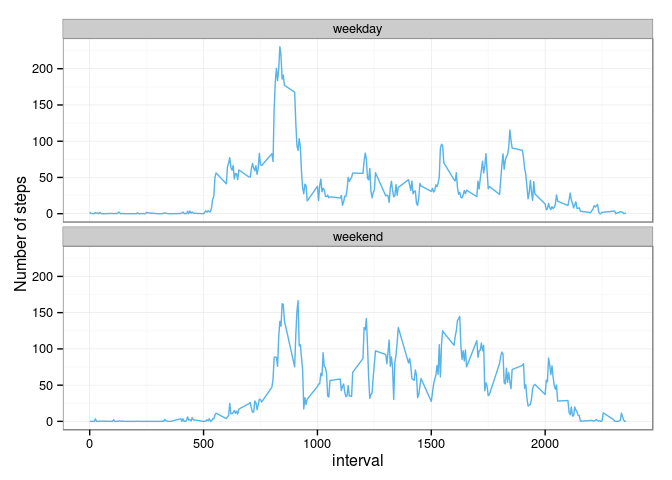

# Reproducible Research: Peer Assessment 1


## Loading and preprocessing the data

```r
library(dplyr)
library(lubridate)
library(ggplot2)
library(knitr)
opts_chunk$set(fig.path='figure/')
Sys.setlocale("LC_TIME", "en_US.UTF8")
```

```
## [1] "en_US.UTF8"
```

1. Load the data


```r
# unzip and read activity data
zipfile <- "activity.zip"
csvfile <- "activity.csv"
activity <- read.csv(unz(zipfile,csvfile), sep = ",")
```

2. Process/transform the data into a format suitable


```r
activity <- na.omit(activity)
activity$interval <- ((activity$interval%/% 100 * 60) + activity$interval%%100)*60
```


## What is mean total number of steps taken per day?

1. Histogram of the total number of steps taken each day


```r
activity_df <- tbl_df(activity)
activity.dailySteps <- activity_df %>%
      group_by(date) %>%
      summarise(stepsDay = sum(steps))
with(activity.dailySteps,plot(as.Date(date,'%Y-%m-%d'),stepsDay,
                type = "h",
                cex.lab=0.7, 
                cex.axis=0.7, 
                cex.main=0.7,
                cex.sub=0.7,
                xlab="Date"))
```

 

2. The mean and median total number of steps taken per day


```r
summary(activity.dailySteps$stepsDay)
```

```
##    Min. 1st Qu.  Median    Mean 3rd Qu.    Max. 
##      41    8841   10760   10770   13290   21190
```


## What is the average daily activity pattern?

1. Time series plot of the 5-minute interval (x-axis) and the average number of steps taken, averaged across all days (y-axis)


```r
activity_df <- tbl_df(activity)
activity.stepsInterval <- activity_df %>%
      group_by(interval) %>%
      summarise(stepsInterval = mean(steps))

with(activity.stepsInterval,plot(interval,stepsInterval,
                              type = "h",
                              cex.lab=0.7, 
                              cex.axis=0.7, 
                              cex.main=0.7,
                              cex.sub=0.7,
                              xlab="Time"))
```

 

2. Which 5-minute interval, on average across all the days in the dataset, contains the maximum number of steps?


```r
seconds_to_period(activity.stepsInterval$interval[which.max(activity.stepsInterval$stepsInterval)])
```

```
## [1] "8H 35M 0S"
```


## Imputing missing values

1. The total number of missing values in the dataset 


```r
activity_na <- read.csv(unz(zipfile,csvfile), sep = ",")
sum(is.na(activity_na))
```

```
## [1] 2304
```

2. Strategy for filling in all of the missing values in the dataset: Fill with the mean of that interval


```r
activity_na$steps[is.na(activity_na$steps)] <- activity.stepsInterval$stepsInterval
```

3. Create a new dataset that is equal to the original dataset but with the missing data filled in.


```r
activity_filled <-activity_na
head(activity_filled)
```

```
##       steps       date interval
## 1 1.7169811 2012-10-01        0
## 2 0.3396226 2012-10-01        5
## 3 0.1320755 2012-10-01       10
## 4 0.1509434 2012-10-01       15
## 5 0.0754717 2012-10-01       20
## 6 2.0943396 2012-10-01       25
```

4. A histogram of the total number of steps taken each day and Calculate and report the mean and median total number of steps taken per day. Do these values differ from the estimates from the first part of the assignment? What is the impact of imputing missing data on the estimates of the total daily number of steps?


```r
activity_filled_df <- tbl_df(activity_filled)
activity_filled.dailySteps <- activity_filled_df %>%
      group_by(date) %>%
      summarise(stepsDay = sum(steps))

with(activity_filled.dailySteps,plot(as.Date(date,'%Y-%m-%d'),stepsDay,
                              type = "h",
                              cex.lab=0.7, 
                              cex.axis=0.7, 
                              cex.main=0.7,
                              cex.sub=0.7,
                              xlab="Date"))
```

 

```r
summary(activity_filled.dailySteps$stepsDay)
```

```
##    Min. 1st Qu.  Median    Mean 3rd Qu.    Max. 
##      41    9819   10770   10770   12810   21190
```

The mean didn't differ because of the fill startegy but median does a little bit. There is almost no impact of imputing missing data.

## Are there differences in activity patterns between weekdays and weekends?

1. Create a new factor variable in the dataset with two levels – “weekday” and “weekend” indicating whether a given date is a weekday or weekend day.


```r
activity_filled$day[weekdays(as.Date(activity_filled$date)) %in% c('Saturday','Sunday')] <- 'weekend'
activity_filled$day[is.na(activity_filled$day)] <- 'weekday'
```

2. A panel plot containing a time series plot of the 5-minute interval (x-axis) and the average number of steps taken, averaged across all weekday days or weekend days (y-axis).


```r
activity_df <- tbl_df(activity_filled)
activity_filled.stepsInterval <- activity_df %>%
      group_by(day,interval) %>%
      summarise(stepsInterval = mean(steps))

g <- ggplot(activity_filled.stepsInterval,aes(x=interval,y=stepsInterval))
g + geom_line(colour="#56B4E9") +  facet_wrap(~ day, nrow = 2, ncol = 1,) + labs(y = "Number of steps") + theme_bw()
```

 
